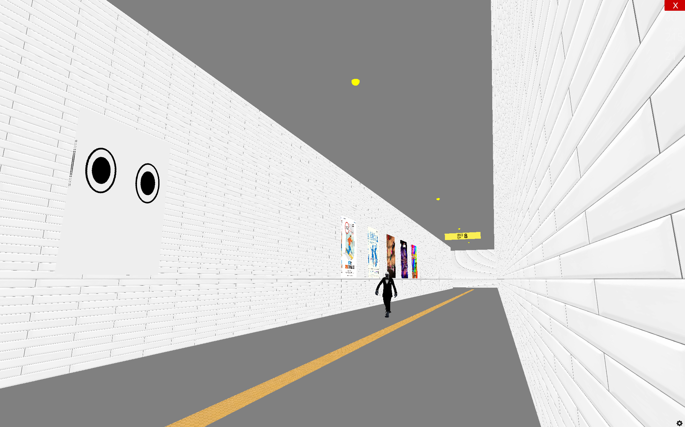

# 창연이의 Exit 8

창연이의 Exit 8, Python, Ursina game engine

## Game Overview
A horror-themed corridor game where players must navigate through a mysterious hallway while avoiding anomalies and an NPC.

## How to Play

1. Movement Controls
- Use WASD keys to move around
- Mouse to look around
- Spacebar to jump

2. Game Goal
- Successfully navigate through the corridor 8 times to win
- Avoid touching the patrolling NPC
- Handle anomalies carefully

3. Corridor Navigation Rules
- When anomaly is active:
  - Go to back section to resolve the anomaly
  - Going to front section during anomaly = Game Over
- When no anomaly is active:
  - Go to front section to progress
  - Each successful loop increases your progress counter

4. Tips
- Watch the NPC's patrol pattern and time your movements
- Pay attention to anomaly effects to identify when they're active
- Use the exit signs to track your progress (0-8)
- Stay away from edges to avoid falling

## Key Features
- First-person perspective gameplay with mouse/keyboard controls
- Patrolling NPC that follows a set path and must be avoided
- Random anomaly events that affect the environment:
  - NPC size doubling
  - Floor color darkening
  - Wall texture changing to "wallkill" texture
  - NPC walking backwards animation
  - Poster sets changing between normal/A/B variants
  - Interactive eye poster that tracks player movement
  - Darkness effect on lights and surfaces
  - Growing poster animations
  - Door disappearing/opening effects
- Progress tracking via numbered exit signs (0-8)
- Multiple corridor sections with teleportation between them
- Victory achieved after 8 successful loops

## Code Structure
- Uses Ursina engine for 3D graphics and physics
- Clean separation of game mechanics:
  - Environment setup with main corridor, front/back sections
  - Decorative elements like floor tiles, lamps, posters
  - Interactive elements like doors with handles
  - Player first-person controller with collision
  - Animated NPC using glTF model
  - Anomaly trigger and resolution system
  - Game state tracking and win/loss conditions

## Technical Implementation
- Global state management for game progress and anomalies
- Modular functions for game_over(), clear_game(), trigger_anomaly()
- Position-based collision detection with NPC and boundaries
- Animation system for doors, posters, and environment effects
- Asset management for wall/poster textures and NPC model
- Randomized anomaly system with non-repeating selection

## Areas for Potential Enhancement
- Additional anomaly types beyond current 12 variants
- More complex NPC pathing and behaviors
- Sound effects and ambient audio
- Progressive difficulty scaling
- Save/load system for progress
- Additional corridor variations and layouts

## Anomaly List
1. Scale NPC
   - Doubles the size of the patrolling NPC
   - Creates an imposing presence in the corridor

2. Floor Color
   - Changes the floor to a darker shade
   - Alters the atmosphere of the environment

3. Wall Texture
   - Replaces normal wall texture with "wallkill" variant
   - Creates an unsettling visual effect

4. Backward NPC
   - Makes the NPC walk backwards while patrolling
   - Reverses animation and rotation direction

5. Change Poster Set A
   - Switches all posters to alternate set A
   - Features more disturbing imagery

6. Change Poster Set B
   - Switches all posters to alternate set B
   - Features different unsettling visuals

7. Eye Direction
   - Makes eye poster track player movement
   - Follows left/right as player passes

8. Eye Flash
   - Triggers red flash effect on eye poster
   - Activates when player is directly in front

9. Darkness
   - Turns off all corridor lighting
   - Darkens walls, floor, and ceiling

10. Growing Posters
    - Animates posters to grow larger
    - Creates distorted wall decorations

11. Door Open
    - Triggers automatic door opening
    - Activates when player approaches

12. Door Disappear
    - Makes doors temporarily vanish
    - Removes physical barriers in corridor

